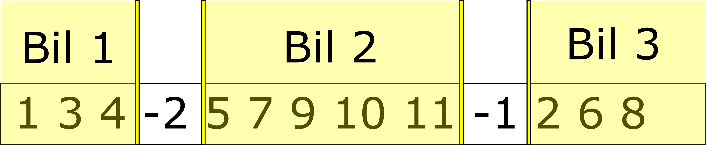

# Workshop om evolusjonære algoritmer

Dette er en workshop som forhåpentligvis vil gi et innblikk i hva evolusjonære algoritmer er, hvordan de fungerer, og litt om hva slags problemer man kan løse med slike algoritmer. Workshopen er delt inn i tre deler av økende vanskelighetsgrad, og i hver del skal man løse et problem ved hjelp av en eller
flere evolusjonære algoritmer.

Selv om det er lagt opp til et bestemt sett med oppgaver i en bestemt rekkefølge, må du gjerne følge deg fri til å løse oppgavene i en annen rekkefølge, hoppe over enkelte oppgaver, eller bare leke deg med koden slik du selv vil.

## Oppsett og kjøring

Vis innhold

Workshoppen bruker Python, og alle avhengigheter er definert i `requirements.txt`. Sett gjerne opp et virtuelt miljø på den måten du selv foretrekker, og installer alle avhengigheter med `pip`.

Det er lagt opp til at alle oppgavene kjøres gjennom `main.py`. Denne inneholder et enkelt CLI som lar deg kjøre en bestemt løsning på et bestemt problem i syntaksen `python main.py <problem> <algoritme>`. For eksempel kan man kjøre `python main.py tsp hc` for å kjøre Hill Climbing-løsningen av Travelling Salesman-problemet. Ta gjerne en titt på koden for å se hva du kan gjøre, og føl deg fri til å lage dine egne løsninger.

## Løsningsforslag

  
Vis innhold

Det anbefales å prøve så godt man kan å løse oppgavene selv, men dersom du skulle stå helt fast, er det mulig å ta en titt på hvordan oppgavene er løst i branchen `lf`.

## 1. Travelling Salesman Problem

Vis innhold

[Travelling Salesman Problem (TSP)](https://en.wikipedia.org/wiki/Travelling_salesman_problem) er et mye brukt eksempelproblem, og egner seg godt til å løses med evolusjonære algoritmer. Problemet er [NP-hardt](https://en.wikipedia.org/wiki/NP-hardness), og det er derfor upraktisk å lage en deterministisk algoritme for å løse problemet. Derimot kan det ofte løses effektivt med en meta-heuristisk algoritme som for eksempel en genetisk algoritme.

Traveling Salesman Problem går ut på at en handelsmann skal besøke et gitt sett av byer. Han skal besøke alle byene, og må ende opp i samme by som han starter. Gitt disse forutsetningene ønsker han å planlegge en kortest mulig reisevei mellom byene:

I første del skal vi løse en variant av TSP. Koden for dette ligger i `travelling_salesman`, med miljøet definert i `environment.py`. Byene blir tilfeldig plassert, og avstand i luftlinje mellom byene blir brukt. Løsningen på problemet er en liste med byene i den rekkefølgen handelsmannen skal besøke de.

### Oppgaver

1. Se på koden i `hill_climbing.py`, og prøvekjør denne løsningen. Prøv å forstå hvordan algoritmen fungerer. Hvorfor funker ikke denne løsningen spesielt godt?
2. Se nå på løsningen i `simulated_annealing.py`, og prøvekjør denne. Blir resultatet annerledes med denne metoden? Hva er grunnen til dette?
3. Se på koden i `genetic_algorithm.py`. Her må du fylle inn en del kode selv for at algoritmen kan kjøre. Finn alle steder som er merket med `# TODO`, og legg inn dine løsninger. Du må blant annet ta stilling til følgende:

   - Initialisering
   - Seleksjon av foreldre
   - Crossover
   - Mutering

   I tillegg er det flere parametere som kan finjusteres for å endre på hvordan algoritmen oppfører seg. Se om du klarer å få algoritmen til å løse Travelling Salesman-problemet.

4. (Valgfritt) Lek deg gjerne med implementasjonen dersom du har tid. Kan man f.eks. innføre flere forskjellige typer mutasjon?

## 2. Vehicle Routing Problem

Travelling Salesman Problem er et nokså enkelt problem å løse med evolusjonære algoritmer – i hvert fall når antallet byer som skal besøkes er nokså lavt, slik det som det var for oss. [Vehicle Routing Problem (VRP)](https://en.wikipedia.org/wiki/Vehicle_routing_problem) er et problem som likner på Traveling Salesman Problem, men vi kompliserer det noe ved å innføre flere aktører. I stedet for at vi har én handelsmann som skal besøke noen byer tenker vi oss at vi har flere kjøretøy som skal samarbeide om å levere pakker til et sett med kunder. Hvert kjøretøy må starte og ende opp på et depot, og kan dessuten bare frakte et begrenset antall pakker. Vi ønsker å minimere den totale avstanden som blir tilbakelagt av alle kjøretøyene.

Med TSP valgte representasjonen av løsningene våre seg litt selv – en liste med rekkefølgen på byene føltes veldig naturlig. For VRP er problemet mer komplekst, og man må legge mer arbeid i å finne en god representasjon. I koden i dette repoet er det valgt en representasjon listerepresentasjon som inneholder indekser til alle byene i den rekkefølgen de skal besøkes. I tillegg inneholder lista (n - 1) negative tall, der n er antallet biler. Alle byer mellom en ende av lista og et negativt tall, eller mellom to negative tall, vil besøkes av samme bilen.:

> Merk: Det finnes mange måter å representere løsningene på, og flere forskjellige representasjoner kan fungere godt. Det er imidlertid viktig å se på representasjon og variasjonsoperatorer (crossover/mutation) i sammenheng, da disse påvirker hverandre.

### Oppgave:

- Gå til `vehicle_routing/genetic_algorithm`, og fyll inn kode alle steder der det står `# TODO`. Prøv å få algoritmen til å finne en god løsning på Vehicle Routing-problemet.

### Ekstraoppgave: Quality Diversity

Til nå har vi primært jobbet med en klassisk genetisk algoritme. Denne er først og fremst lagd for å finne én god løsning på problemet, og man vil ofte oppleve at mange av løsningene i populasjonen er ganske like mot slutten av optimeringsprosessen.

[Quality Diversity](https://www.frontiersin.org/articles/10.3389/frobt.2016.00040/full) er en nokså ny retning innen evolusjonære algoritmer som tar sikte på å finne et sett med forskjellige løsninger ("Diversity") som hver for seg er en god løsning på problemet ("Quality"). En slik algoritme er MAP-Elites, og vi skal ta en liten kikk på denne algoritmen i denne oppgaven.

MAP-Elites er mer en løs strategi enn en komplett algoritme, og bygger på et enkelt prinsipp: vi erstatter populasjonen i genetiske algoritmer med et arkiv av løsninger som er inndelt i etter noen forhåndsdefinerte kriterier. Arkivet inneholder den beste løsningen vi har funnet til nå for hver gruppe disse kriteriene definerer. Dette gjør at en løsning kan bli tatt vare på utelukkende fordi den representerer en annen måte å løse problemet på enn løsningene vi har funnet til nå. Hvis vi derimot senere finner en liknende løsning som er bedre vil denne erstatte den forrige løsningen. Til slutt sitter vi igjen med en variert samling av løsninger som hver er den beste løsningen av den typen vi har funnet.

Vehicle Routing Problem er fortsatt et nokså enkelt problem, men det er komplekst nok til at vi kan prøve ut MAP-elites. En viktig komponent i en MAP-elites-løsning er hvordan arkivet er inndelt. I denne oppgaven prøver vi oss på en inndeling langs to dimensjoner: antall biler som er aktive i løsningen, og gjennomsnittlig lengde på rutene disse tilbakelegger.
